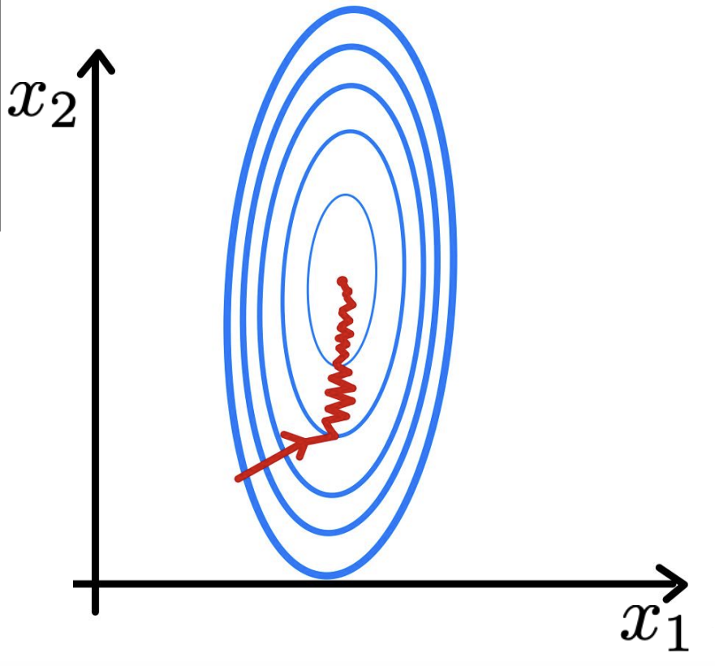
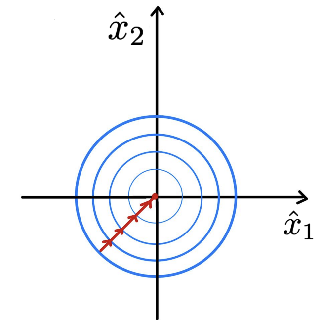
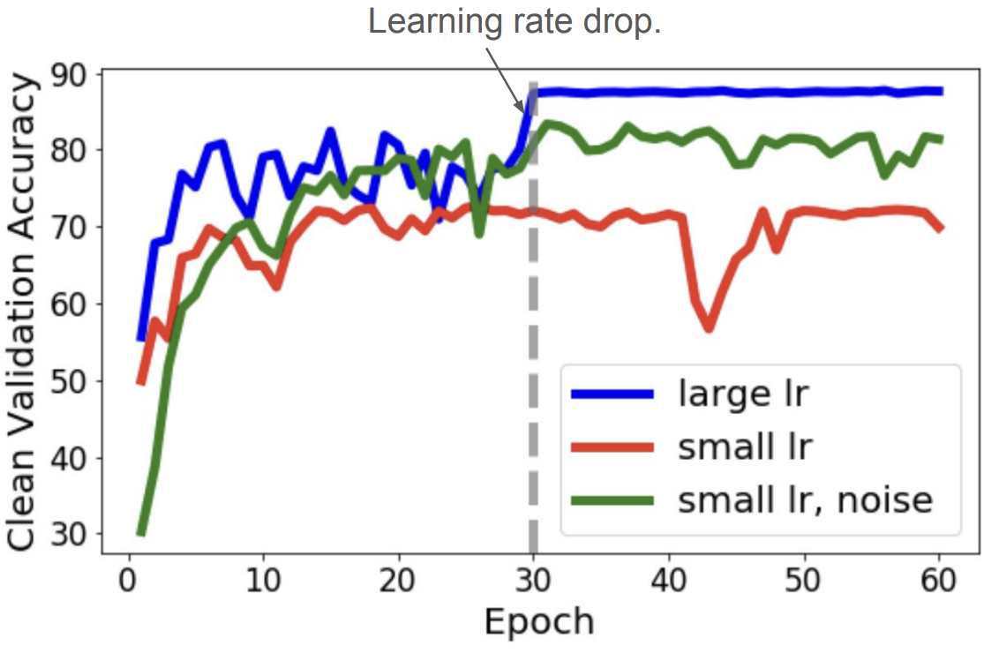

## Batch Normalization
**Batch Normalization** is not a traditional **regularizer** itself, but rather a technique that leads to regularizer-like behavior in model performance. 

Consider a deep learning task that aims to predict house prices. Let $x_1$ be a feature representing bedroom number in [1, 5] and let $x_2$ be a feature representing square footage in the range [0, 2000]. Common sense tells us that a change in the number of bedrooms by 1 bedroom should have a substantial impact on home price, whereas a 1sqft increase will have a far **smaller** impact on the home price. In deep networks, however, we typically do not know *a priori* which features will be significantly relevant, and thus the contour map of the loss function in this example may look like the figure below on the left.

  
  
   
  <em style="font-size: 0.85em;">
    Figure: Unnormalized (left) and Normalized (right) Features w/ Loss Contour. Source: [LeCun et al. 1998]
  </em>

If we instead normalize the features
$$\hat{x}_i \leftarrow \frac{x_i - \mu_i}{\sqrt{\sigma_i^2 + \epsilon}}$$
where $\epsilon$ is a small, positive constant (mainly there to prevent division-by-zero), we see that the contour map of the loss function becomes far more balanced, or spherical, like the plot on the right.

### Why Does This Matter?
Using our knowledge of optimization methods like Gradient Descent, we know that optimizers take steps **perpendicular** to the contour lines of the loss function. In the figure on the left, we see that we must take very small steps (small learning rate) to avoid overshooting one feature (bedroom number) and then are forced to take small steps through the deep valleys trying to find the sweet spot on $x_2$.

In the case of standardized features, our loss function is far smoother, and we can thus use a larger learning rate to find the minima more quickly.

One chief advantage of this is quite apparent: using a larger learning rate speeds up the optimization process greatly, a benefit during training. We will discuss another effect later that has a regularizing effect on model performance.

### Batch Normalization in Deep Networks
In deep networks, Batch Normalization appears as another layer in between two hidden layers. The Batch Normalization layer normalizes the activations output from one layer before passing them as inputs to the next hidden layer. In PyTorch, we use `torch.nn.BatchNorm1d` for 2D or 3D inputs.

#### The Batch Normalization Algorithm
The following algorithm applies the *Batch Normalization Transform* to activation $x$ over a mini-batch.

**Input:** Values of $x$ over a mini-batch: $\mathcal{B} = \{x_1...m\}$;  
Parameters to be learned: $\gamma, \beta$

**Output:** $\{y_i = \text{BN}_{\gamma,\beta}(x_i)\}$

$$\mu_\mathcal{B} \leftarrow \frac{1}{m}\sum_{i=1}^{m} x_i \qquad \text{// mini-batch mean}$$

$$\sigma_\mathcal{B}^2 \leftarrow \frac{1}{m}\sum_{i=1}^{m} (x_i - \mu_\mathcal{B})^2 \qquad \text{// mini-batch variance}$$

$$\hat{x}_i \leftarrow \frac{x_i - \mu_\mathcal{B}}{\sqrt{\sigma_\mathcal{B}^2 + \epsilon}} \qquad \text{// normalize}$$

$$y_i \leftarrow \gamma\hat{x}_i + \beta \equiv \text{BN}_{\gamma,\beta}(x_i) \qquad \text{// scale and shift}$$

#### Inference Behavior
At inference time, taking the mean and variance of one sample, or batch, gives us a very *noisy* and unreliable estimate of population statistics. This can cause a model to be **nondeterministic**, or provide different outputs given the same inputs. To abate this issue, we instead use (at inference time) running average statistics calculated during training as 
$$\mu_{inf} = \lambda\mu_{inf} + (1 - \lambda)\mu_{\mathcal{B}}$$

$$\sigma_{inf}^2 = \lambda\sigma_{inf}^2 + (1 - \lambda)\sigma_{\mathcal{B}}^2$$
where $\lambda$ is a *momentum* parameter (a constant usually ~0.9), and $\mu_{\mathcal{B}}$ and $\sigma_{\mathcal{B}}^2$ are the mean and variance, respectively, of a mini-batch during training.

These running average statistics serve as good estimates of population mean and variance and give us deterministic behavior during inference time.

### Benefits of Batch Normalization
We have already discussed how Batch Normalization allows us to use a larger learning rate and thus speeds up optimization. The second beneficial advtange of using a larger learning rate is that a network may **generalize** better: the core aim of regularization.

  

  <em style="font-size: 0.85em;">
    "Understanding Batch Normalization" by Bjorck et. al 2018
  </em>

The above figures illustrate the regularizing characteristics that appear when Batch Norm is applied and a larger learning rate is used. At small learning rates, the inclusion of Batch Normalization layers does not have an impact on test accuracy. When we increase the learning rates, however, we see that test accuracy improves drastically by reducing overfitting and generalizing better to unseen data. This improvement is a direct effect of the larger learning rate that we were able to use by including Batch Normalization layers in the network.

### Why Does a Larger Learning Rate Generalize Better?
During optimization, noise of the gradient estimate scales with the learning rate. Noisy gradient estimates during optimization are the core of Stochastic Gradient Descent (SGD) as well, which we know improves upon traditional Gradient Descent due to SGD's capacity to escape local minima and find smoother, more general solutions.

Therefore, the noisy gradient estimates from using a larger learning rate help find more global, generalizable solutions in the same manner as SGD.
> *Note:* This behavior is not exclusive to large learning rate optimization. By adding Gaussian noise to the activations of a network during training time we can still see this regularizing effect even at smaller learning rates.

  

  <em style="font-size: 0.85em;">
    “Towards Explaining the Regularization Effect of Initial Large
    Learning Rate in Training Neural Networks” by Li et al., 2019
  </em>

